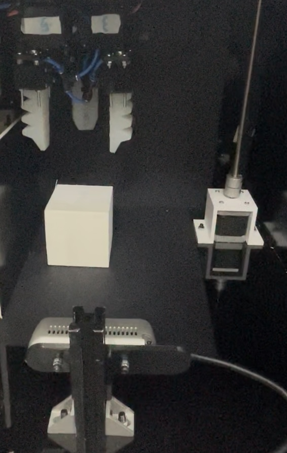

# Vision-Based Adaptive Soft Gripper 

## Project Overview

This project presents an adaptive soft gripper system capable of detecting object shapes using computer vision and estimating object dimensions through 3D point cloud analysis. Based on the detected shape and size, the system automatically adjusts the gripper’s orientation.

The setup uses a RGBD camera to fuse color and depth information, allowing real-time classification of common shapes (e.g., circle, square, rectangle) and dimension estimation from aligned depth data. 

### Features

- Vision-based shape detection using OpenCV  
- Dimension estimation from aligned RGB-D data using point cloud processing via the RealSense SDK  
- Real-time 3D visualization with Open3D  
- Real-time feedback from a bending sensor integrated into the soft gripper for monitoring deformation

### Gripper Actuation Mechanism

  

This rotary-linear mechanism controls the gripper's opening based on servo angles. Three configurations are used:
- **Spherical**: All servos at 90° for round objects.
- **Cylindrical**: Rear servos at 60° and 120°, front at 90°.
- **Parallel**: Rear servos at 145° and 30°, front at 90° for flat surfaces.

These configurations allow adaptive grasping based on object geometry.

---

### Vision-Based Control Setup

  

The Intel RealSense D435i camera is positioned in front of the gripper, facing the object. It captures synchronized RGB and depth data used for shape detection and size estimation. The camera is fixed in place to maintain a consistent field of view during operation.

## Object Shape Detection and Size Estimation Demonstration

<table>
  <tr>
    <td align="center">
       
      <strong>Circle-Shaped Object</strong>
    </td>
    <td align="center">
       
      <strong>Rectangle-Shaped Object</strong>
    </td>
  </tr>
  <tr>
    <td colspan="2" align="center" style="padding-top: 20px;">
       
      <strong>Square-Shaped Object</strong>
    </td>
  </tr>
</table>

